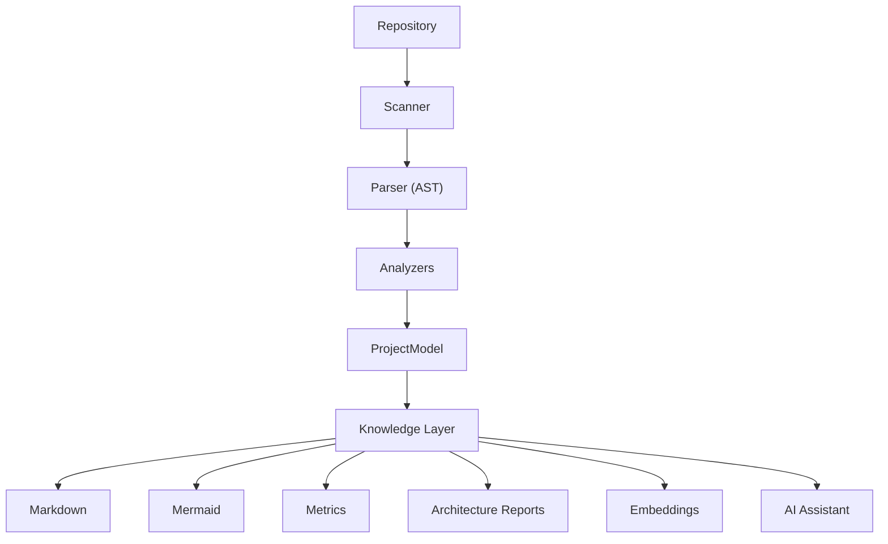

# AutoDocs Development Plans

## Project Vision

AutoDocs is NOT just a Markdown documentation generator.

AutoDocs is a Repository Intelligence Platform.

Its purpose is to understand an entire codebase through static analysis, build an internal knowledge model, generate documentation, visualize architecture, compute repository metrics, and power an AI assistant capable of answering questions about the repository.

The repository itself should become queryable.

Every feature should contribute toward this vision.

---

## Core Pipeline

`ProjectModel` is the single source of truth. Everything must be generated from `ProjectModel`.

---

## Current Status

### Completed

*   [x] CLI
*   [x] Project Loader
*   [x] Scanner
*   [x] Babel Parser
*   [x] Analyzer Engine
*   [x] Import Analyzer
*   [x] Function Analyzer
*   [x] Class Analyzer
*   [x] Export Analyzer
*   [x] Route Analyzer
*   [x] ProjectModel
*   [x] Markdown Generator
*   [x] Mermaid Generator
*   [x] Dependency Graph
*   [x] AI Summaries using Groq

---

## Roadmap

### Phase 1: Parsing, Analysis, and Basic Generation (Completed)
- Parsing codebases into AST structures.
- Static analysis analyzers (Imports, Exports, Functions, Classes, Express Routes, React Components).
- Core Markdown generation replicating repository structures.
- Mermaid graph generation for project dependencies and class UML.
- AI File Summaries using Groq integration.

### Phase 2: Repository Intelligence (Completed)
- Architecture Report (`ARCHITECTURE.md`).
- Folder Summaries (`docs/` summaries).
- Dependency metrics calculation.
- Fan-In / Fan-Out coupling metrics.
- Circular dependency detection.
- Dead file detection (zero inbound local imports).
- Unused export detection.
- Project-wide statistics and complexity metrics.

### Phase 3: Knowledge Layer (Completed)
- Repository index compile (`repository_index.json`).
- Deterministic subword feature-hashing embedding generator.
- Semantic chunking strategy (Overview, classes, functions, routes, components).
- Local vector store serializer/deserializer (`vector_store.json`).
- Semantic vector similarity search.

### Phase 4: Repository Chat (Completed)
- Build an AI assistant capable of:
  - Explaining architecture
  - Finding implementations
  - Debugging code
  - Suggesting modifications
  - Explaining data flow
  - Answering repository questions
- Retrieve context from `ProjectModel` and the pre-computed Knowledge Layer (index, vector store, architecture reports, dependency graphs) instead of reading raw repository files in real-time.

### Phase 5: Repository Engineering Agent (Completed)
- Support:
  - Refactoring suggestions
  - Migration planning
  - Test generation
  - README generation
  - Architecture review
  - Impact analysis
  - Code quality reports

---

## Architecture Rules

- **Preserve existing architecture**: Keep abstractions clean and aligned with existing code designs.
- **ProjectModel as source of truth**: All semantic and structural features flow from the model.
- **Independent analyzers**: Keep AST parsing and analysis isolated.
- **Plugin-based AnalyzerEngine**: Register analysis hooks modularly.
- **Small incremental milestones**: Commit and verify changes sequentially.
- **No unnecessary refactoring**: Avoid altering working code outside the immediate milestone scope.
- **ES Modules only**: Use modern `import`/`export` syntax.
- **Production-quality code**: Clean, readable, documented APIs.
- **JSDoc documentation**: Document exported APIs using JSDoc formatting.
- **Return only changed files**: Keep commits and modifications focused.
- **Do not modify unrelated modules**: Avoid collateral edits to non-target files.
